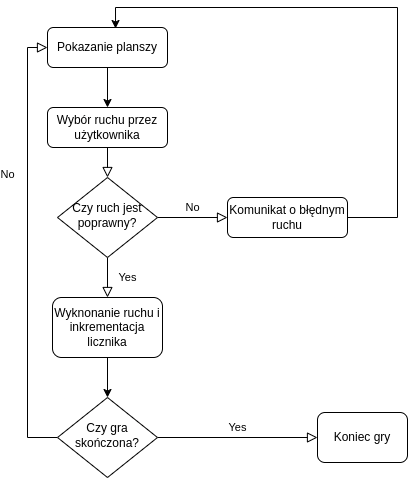

Wojciech Styczeń, 303776

# Sprawozdanie lab 1

## Wykorzystane techonologie

> Kompilacja na _Ubuntu 18.04 LTS_, przy użyciu _gcc 7.5.0_.
>
> Kod napisany w VSCode, sformatowany przy użyciu _clang-format_ w stylu _Chromium_.
>
> [GitHub](https://github.com/wstyczen/PROS.git)

## Program

### Wykaz zmiennnych

#### Zmienne globalne

```c
const int ROWS = 9, COLS = 9; // Sizes of the board.
const char CIRCLE = 'o', CROSS = 'x', WALL = '+'; // Fields of the board.
```

#### Stan gry - tablica i licznik ruchów

```c
// Initialize game board.
char board[ROWS][COLS];
fill_with(board, CIRCLE);
// Stores player's move count.
int move_count = 0;
```

#### Ruch użytkownika (user input)

```c
int row, col; // User input.
```

### Funkcje

```c
// Overwrites all the fields of the board with given value.
void fill_with(char board[ROWS][COLS], char value);

// Prints a separator for the board.
void print_separator();

// Prints the game board to the terminal.
void display_board(char board[ROWS][COLS]);

// Switches the value of the given field - from CROSS to CIRCLE or from CROSS
// TO CIRCLE. If the indices are outside of board it is ignored.
void switch_field(char board[ROWS][COLS], int row, int col);

// Tries to play according to the user-given input.
bool put(char board[ROWS][COLS], int row, int col);

// Checks whether the board contains only the given value.
bool is_full_of(char board[ROWS][COLS], char value);
```

### Główna pętla gry

#### Przebieg rundy (iteracji)

1. Pokazanie planszy gry i licznika wykonanych ruchów.
2. Wybór ruchu przez użytkownika (rząd i kolumna).
3. Walidacja ruchu - jeśli był niepoprawny to pokazanie komunikatu i nowa iteracja.
4. Jeśli ruch jest poprawny, inkrementacja licznika ruchów i wykonanie ruchu (zamiana typu pola na przeciwny dla wybranego i przylegających).
5. Sprawdzenie czy gracz wygrał - czy wszystkie pola są odpowiedniego typu (krzyżyk). Jeśli tak, to gra jest przerywana. Jeśli nie to nowa iteracja.

#### Graf przejść


